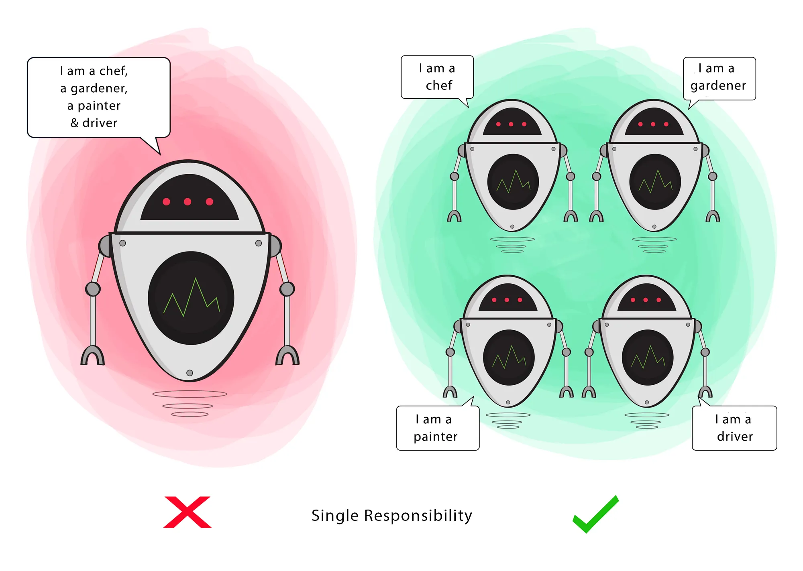

# SOLID Principles in Object-Oriented Programming

The SOLID principles are a set of design guidelines that help developers build maintainable, scalable, and robust object-oriented systems.

---

## 1. S — Single Responsibility Principle (SRP)

A class should have only one responsibility, meaning it should have only one reason to change.

### Problems with Multiple Responsibilities:
- Increased chances of bugs
- Changes in one responsibility may affect unrelated functionality

### Goal:
This principle aims to separate behaviors so that changes in one part of the system do not impact other unrelated parts.

---

## 2. O — Open/Closed Principle (OCP)

Classes should be **open for extension** but **closed for modification**.

### Explanation:
Modifying an existing class can introduce bugs in systems that already depend on it. Instead, new functionality should be added by extending the class.

### Goal:
To allow the behavior of a class to be extended without altering its existing code, ensuring stability and reducing regression issues.

---

## 3. L — Liskov Substitution Principle (LSP)

If `S` is a subtype of `T`, then objects of type `T` should be replaceable with objects of type `S` without altering the correctness of the program.

### Explanation:
A child class must be able to perform all the actions of its parent class without causing unexpected behavior.

- The child class should honor the contract defined by the parent.
- It may extend behavior but should not break expected functionality.

### Example:
If a parent class returns `Coffee`, a child class can return `Cappuccino` (a specific type of Coffee), but not something unrelated like `Water`.

### Goal:
To ensure consistency so that parent and child classes can be used interchangeably without errors.

---

## 4. I — Interface Segregation Principle (ISP)

Clients should not be forced to depend on methods they do not use.

### Explanation:
Large interfaces with many methods can force classes to implement unnecessary functionality, leading to:
- Unused code
- Increased complexity
- Higher risk of bugs

Instead, interfaces should be split into smaller, more specific ones.

### Goal:
To ensure that a class only implements methods that are relevant to its functionality.

---

## 5. D — Dependency Inversion Principle (DIP)

- High-level modules should not depend on low-level modules. Both should depend on abstractions.
- Abstractions should not depend on details. Details should depend on abstractions.

### Key Concepts:
- **High-level module**: Contains core business logic
- **Low-level module**: Handles implementation details (e.g., database, APIs)
- **Abstraction**: Interface that connects the two

### Explanation:
A class should not directly depend on a concrete implementation. Instead, it should depend on an interface.

This decouples the system and makes it easier to:
- Replace implementations
- Test components independently
- Scale the system

### Goal:
To reduce tight coupling between components by introducing abstraction layers.

---

## Summary

| Principle | Purpose |
|----------|--------|
| SRP | One class, one responsibility |
| OCP | Extend behavior without modifying existing code |
| LSP | Subtypes must be replaceable for base types |
| ISP | Use small, specific interfaces |
| DIP | Depend on abstractions, not implementations |

---

## Additional Note

Following SOLID principles leads to:
- Better code readability
- Easier testing
- Improved scalability
- Reduced maintenance cost

However, they should be applied **practically**, not blindly. Over-engineering can make systems unnecessarily complex.