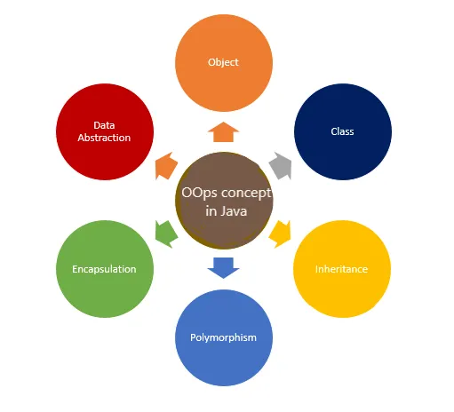

# Object-Oriented Programming (OOP)

OOP is about **managing complexity using objects that encapsulate state and behavior**.



---

## 🧱 Object & Class

### Class

* Blueprint/template to create objects
* Defines **variables + methods**
---

### Object

* Instance of a class
* Has **actual data + behavior**

---

### ⚡ Key Difference

* **Class** → Design
* **Object** → Real instance

👉 One class can create multiple objects


---

# 🔥 4 Pillars of OOP

## 1. Encapsulation
> Control how data is accessed and modified.

- Protects internal state
- Enforces business rules

---

## 2. Abstraction
> Defines **what** a system does, not **how** it does it.

- Hides implementation details
- Exposes only necessary functionality

---

## 3. Inheritance
> Represents an **IS-A** relationship with behavioral compatibility (LSP).

- Enables code reuse
- Must follow Liskov Substitution Principle

---

## 4. Polymorphism

### Compile-time (Method Overloading)
- Same method name, different parameters

### Runtime (Method Overriding)
- Method resolved at runtime based on object type

---

# 🧩 Class Relationships in OOP

## Relationships Spectrum:
> **Association → Aggregation → Composition**  
(weak → stronger → strongest)

---
## 🧩 Class Relationships & Design Principles

---

### 1. Association (Loose Relationship)

#### Explanation:
- Doctor treats patient
- Both exist independently

✅ No ownership, only interaction

---
## 2. Aggregation (Weak HAS-A)

```java
import java.util.List;

class Song {
    String title;
}

class Playlist {
    List<Song> songs;

    Playlist(List<Song> songs) {
        this.songs = songs;
    }
}
```

### Explanation

* A **Playlist** has **Songs**
* Songs exist **independently** of the playlist

### Key Characteristics of Aggregation

* It represents a **weak "HAS-A" relationship**
* The child object (**Song**) does **not depend** on the parent (**Playlist**)
* Multiple parent objects can share the same child objects

### Behavior

If the **Playlist is deleted**:

* Songs still exist ✅
* Songs can be reused/shared across multiple playlists ✅

## 3. Composition (Strong HAS-A)

```java
class Room {
    String type;

    Room(String type) {
        this.type = type;
    }
}

class House {
    private Room livingRoom;
    private Room kitchen;

    House() {
        this.livingRoom = new Room("Living Room");
        this.kitchen = new Room("Kitchen");
    }
}
```

### Explanation

* A **House** owns **Rooms**
* Rooms **cannot exist independently** of the House

### Behavior

If the **House is destroyed**:

* Rooms are also destroyed ❌
* Rooms cannot exist separately ❌


## ⚖️ Cohesion & Coupling

### High Cohesion + Low Coupling = Good Design

---

## 🧠 Cohesion (Within a Class)

**Cohesion** = how closely related the responsibilities inside a class are

### Rule

> One class → one responsibility

---

### ✅ High Cohesion

```java id="c1hs8a"
class PaymentService {

    public void processPayment() {
        // payment logic
    }

    public void validatePayment() {
        // validation logic
    }
}
```

✔ All methods are related to **payment handling**
✔ Clear responsibility
✔ Easy to maintain and understand

---

### ❌ Low Cohesion

```java id="l9ks2p"
class UtilityService {

    public void sendEmail() {}
    public void generateReport() {}
    public void processPayment() {}
}
```

❌ Unrelated responsibilities mixed together
❌ Hard to maintain and extend
❌ Violates single responsibility principle

---

💡 **Cohesion = how well parts of a class belong together**

---

## 🔗 Coupling (Between Classes)

**Coupling** = how much one class depends on another

---

### ❌ High Coupling

```java id="h2ks8q"
class EmailService {
    public void send(String msg) {
        System.out.println("Email: " + msg);
    }
}

class NotificationService {
    private EmailService emailService = new EmailService(); // tightly coupled

    public void notifyUser(String msg) {
        emailService.send(msg);
    }
}
```

❌ Direct dependency on concrete class
❌ Hard to change or replace implementation
❌ Difficult to test (mocking is hard)

---

### ✅ Low Coupling

```java id="l0ks7x"
interface NotificationSender {
    void send(String msg);
}

class EmailSender implements NotificationSender {
    public void send(String msg) {
        System.out.println("Email: " + msg);
    }
}

class NotificationService {
    private NotificationSender sender;

    public NotificationService(NotificationSender sender) {
        this.sender = sender;
    }

    public void notifyUser(String msg) {
        sender.send(msg);
    }
}
```

✔ Uses abstraction (**interface**)
✔ Easy to switch implementations (SMS, Push, etc.)
✔ Better testability (mock interfaces)

---

💡 **Low coupling = flexibility + scalability + maintainability**

---